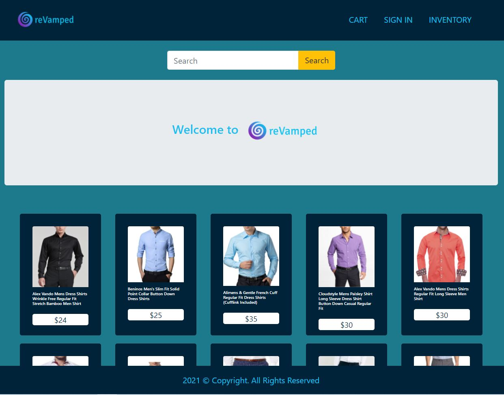

# Unit 15: Project 2 EyeRead

## Table of Contents

* [Deployed Site](#deployed-site)
* [Description](#description)
* [User Story](#user-story)
* [Screenshots](#screenshots)
* [Technologies](#Technologies)
* [Installation](#installation)
* [Credits](#Credits)
* [Challenges](#Challenges)
* [Successes](#Successes)
* [Sources](#Sources)
* [License](#License)
* [Contributing](#contributing)

## Deployed Site
Deployed Website: https://e-commerce-revamped.herokuapp.com/

## Description
reVamped is an E-Commerce clothing retail store, that allows guests to search for causal or business casual selections to update their personal wardrobe and look.

## User Story
- As a User, I would like to navigate to an easy to read, simple, clean Online Clothing Store. As a User, I would like to search for stylish quality Men’s / Women’s clothing brands, styles, and item descriptions. As a User, I would like to quickly add or remove items to my cart before purchasing.  

## Motivation for Development: 
We at reVamped, are motivated to bring ease and efficiency to our guests. Our easy to use User Interface and speedy checkout allows our guests to find what they need effortlessly.  As seasons change so should your wardrobe! Goodbye Quarantine, Hello Quality!

## Breakdown of tasks and roles: 
Laura was our Git Master and worked in the Back-End. She was responsible for Routing and Functionality. Andrew took care of our Items Admin and Inventory. Carlos and Nelson were responsible for the Front-End. Carlos created our sites style components and Logo. Nelson populated the site’s images/descriptions and powerpoint. 

## Screenshots
---
Home Page

## Technologies

- React.js
- REACT-BOOTSTRAP
- MYSQL
- CSS
- Node.Js
- Sequelize 
- JAVA SCRIPT
- Axios.js
- Babel

## Installation

No need any installation for this project.

See deployed site here: https://e-commerce-revamped.herokuapp.com/

See repository here: https://github.com/Lauracejas/e-commerce-customs

## Credits
- We want to thank Anthony and Max for all of their help!

## Challenges
As a group we had many challenges with React. Populating images and maintaining our folder structure was a struggle. We had to redesign our wireframe a few times as well. Overall, we found ourselves teaching each other and doubling down on research to get functionality.

## Successes
 Although at times we felt extremely frustrated, we kept pushing to better develop our concept, while learning along the way. 

 ## Future Development
 
- Process payment.
- reVamped can sell other items besides Apparel.
- An Elite subscription membership that gives guests cheaper prices and better deals.
- Free delivery for Elite subscription members. 
- Guests can save searched items to a wishlist.
- Guests can see Item suggestions based on previous purchases or searched items. 

## Sources

- Class activities
- [google.com](https://www.google.com/)
- [npmjs](https://www.npmjs.com/)
- [ReactRouter](https://reactrouter.com/web/api/Hooks/useparams)
- [ReactHooks](https://reactjs.org/docs/hooks-reference.html)

## License
- Copyright (c) 2021 Ryan Murdock, Phil Wang

Permission is hereby granted, free of charge, to any person obtaining a copy
of this software and associated documentation files (the "Software"), to deal
in the Software without restriction, including without limitation the rights
to use, copy, modify, merge, publish, distribute, sublicense, and/or sell
copies of the Software, and to permit persons to whom the Software is
furnished to do so, subject to the following conditions:

The above copyright notice and this permission notice shall be included in all
copies or substantial portions of the Software.

THE SOFTWARE IS PROVIDED "AS IS", WITHOUT WARRANTY OF ANY KIND, EXPRESS OR
IMPLIED, INCLUDING BUT NOT LIMITED TO THE WARRANTIES OF MERCHANTABILITY,
FITNESS FOR A PARTICULAR PURPOSE AND NONINFRINGEMENT. IN NO EVENT SHALL THE
AUTHORS OR COPYRIGHT HOLDERS BE LIABLE FOR ANY CLAIM, DAMAGES OR OTHER
LIABILITY, WHETHER IN AN ACTION OF CONTRACT, TORT OR OTHERWISE, ARISING FROM,
OUT OF OR IN CONNECTION WITH THE SOFTWARE OR THE USE OR OTHER DEALINGS IN THE
SOFTWARE.

## Contributing
---

Laura Cejas: [@Lauracejas](https://github.com/Lauracejas)

Carlos Abril: [@cabril87](https://github.com/cabril87git)

Nelson Escalante: [@nescalante92](https://github.com/nescalante92)

Andrew Coon: [@ACCoon](https://github.com/ACCoon)

© 2021 Trilogy Education Services, LLC, a 2U, Inc. brand. Confidential and Proprietary. All Rights Reserved.